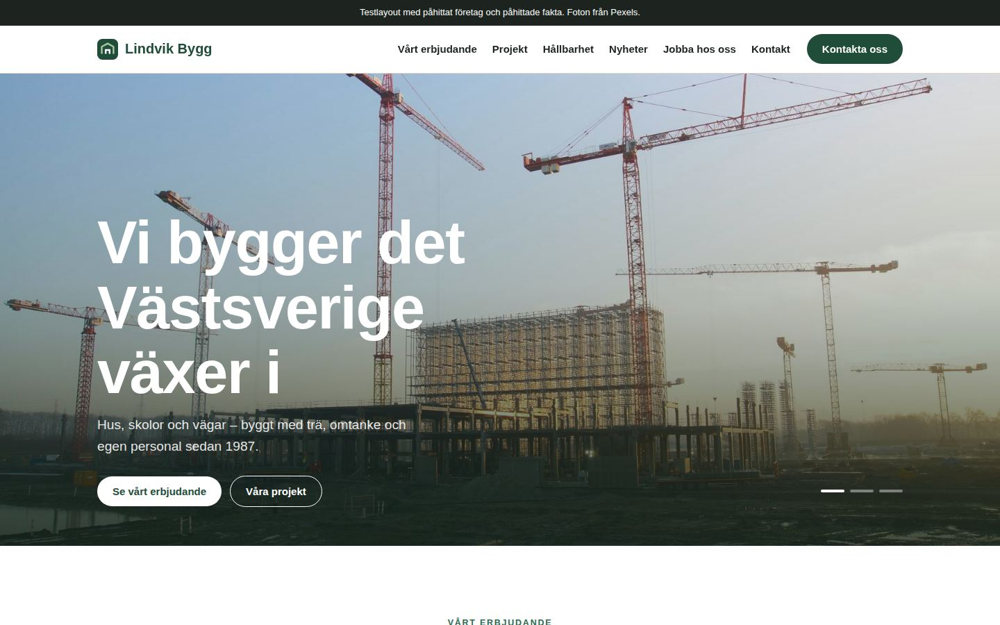
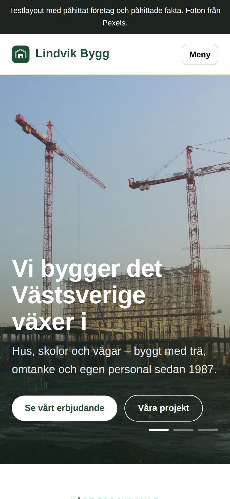
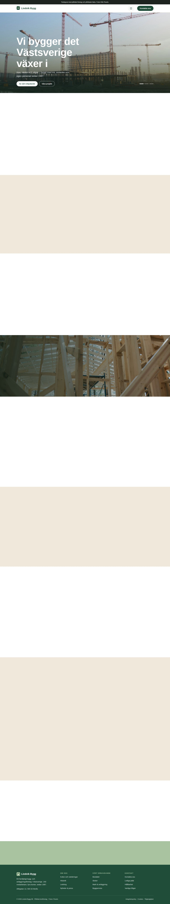

# Lindvik Bygg – testlayout

En testhemsida för ett påhittat byggföretag. Den är ihopsatt av favoritdelarna från nio svenska byggsajter (Svevia, Granitor, GBJ Bygg, Brixly, BDX, Contractor, ByggPartner, Myresjöhus och Bellman Group), i vitt, beige och skogsgrönt.

All fakta är påhittad. Fotona kommer från [Pexels](https://www.pexels.com).

## Förhandsvisning

**Dator**

**Mobil**

<b>Hela sidan på datorn</b> (klicka för att visa)

## Delar på sidan

| Del | Inspirerad av |
| --- | --- |
| Toppen med bildspel | Svevia, Granitor |
| Åtta "dörrar" (tjänster) | Granitor, GBJ Bygg, Brixly, Contractor, ByggPartner |
| Om oss med tre spalter | Brixly, BDX, ByggPartner |
| Projekt att svepa | GBJ Bygg, Brixly, Granitor, Contractor |
| Helhetserbjudande med överlappande kort | Svevia, GBJ Bygg |
| Hållbarhet med mosaik | Contractor |
| Nyheter | Svevia, Myresjöhus, BDX |
| Jobba hos oss | Svevia, Contractor |
| Våra bolag och genvägar | Granitor, ByggPartner |
| Vanliga frågor | GBJ Bygg |
| Kundtjänst | Svevia |
| Botten | Granitor, ByggPartner |

## Öppna sidan

Sidan ligger i mappen [`docs/`](docs/) och visas på **https://elevatestudio018.github.io/lirk/** när GitHub Pages är påslaget. Du kan också öppna `docs/index.html` i en webbläsare. Sidan behöver inga verktyg eller installationer.
